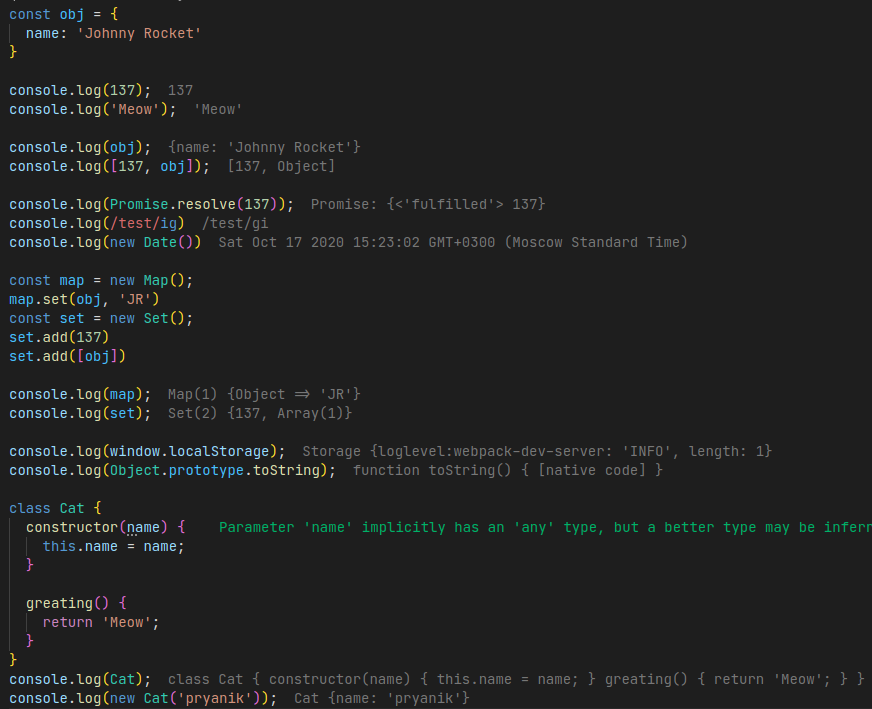
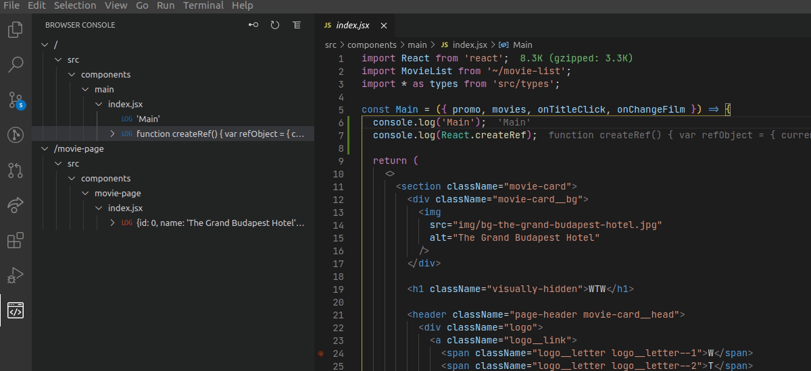
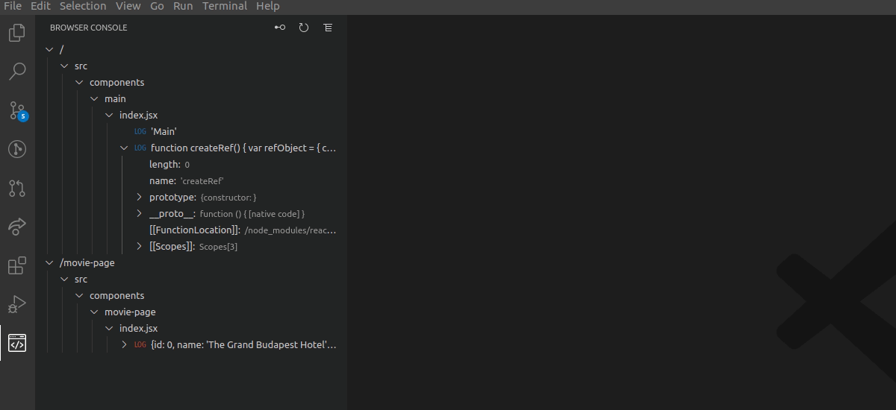

# Browser Console VSCode extension

## Features

- ### Page routing

- ### Log icons by type

- ### Decorate log line

- ### Show object property descriptors and hide enumerable property

- ### Go to log line

## TODO

### Custom events
